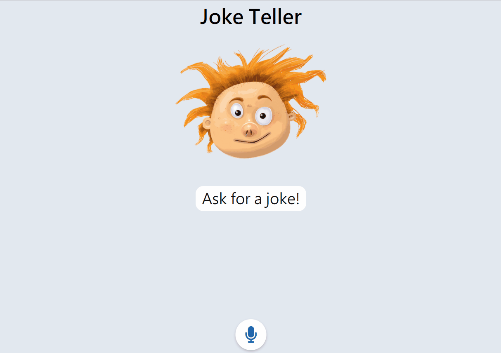

# Joke Teller 

this app is modified from one project in udemy course: [JavaScript Web Projects: 20 Projects to Build Your Portfolio](https://www.udemy.com/course/javascript-web-projects-to-build-your-portfolio-resume/)

# Hoe To Play

you can press the microphone button and ask: "tell me a joke!", the joke telling bot will give you a joke about programming, both sound and text!

[Live Demo](https://kalpaswang.github.io/joke-teller/)